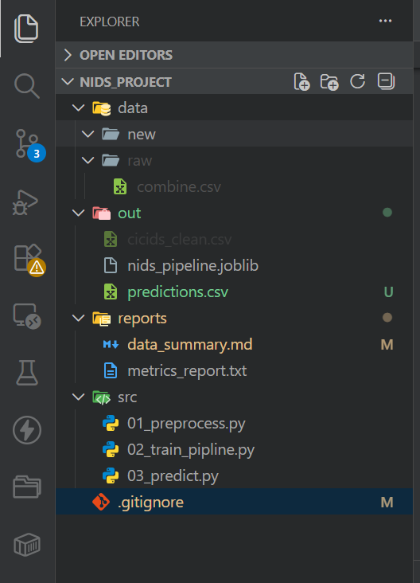
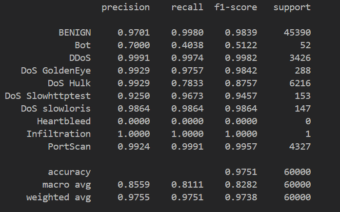

# NIDS Pipeline Project – CIC-IDS2017

## 1. Dataset Description
- Dataset name: CIC-IDS2017  
- Source: Canadian Institute for Cybersecurity (CIC)  
- Type: Network traffic flows (CSV files)  
- Objective: Network Intrusion Detection and multi-class traffic classification  

The dataset contains benign traffic as well as multiple attack types such as DoS, DDoS, PortScan, Botnet, Infiltration, and others.

---

## 2. Raw Data Analysis
- Initial number of rows (flows): 2,214,469  
- Initial number of features: 79  
- Raw files used: combine.csv  

The raw dataset contains missing values (NaN) and infinite values (Inf), which require preprocessing before applying machine learning models.

---

## 3. Data Cleaning and Preprocessing

### 3.1 Handling Missing and Infinite Values
- Infinite values (+Inf, −Inf) were replaced with NaN  
- Rows containing NaN values were removed  
- Number of removed rows: 2,438  

### 3.2 Removal of Irrelevant Columns
The following columns were removed because they do not contribute to learning:
- Flow ID  
- Timestamp  

### 3.3 Data Type Processing
- All feature columns were converted to numeric values  
- Non-numeric values were coerced and removed  

---

## 4. Clean Dataset Description
- Final number of rows: 2,212,030  
- Final number of columns: 79  
  - 78 input features  
  - 1 target column (Label)  

The cleaned dataset contains only numerical features and no missing values, making it suitable for machine learning pipelines.

---

## 5. Target Classes (Labels)

The target variable Label represents the traffic category.  
The problem is therefore a multi-class classification task.

| Label            | Number of samples |
|------------------|------------------|
| BENIGN           | 1,671,484 |
| DoS Hulk         | 230,124 |
| PortScan         | 158,804 |
| DDoS             | 128,027 |
| DoS GoldenEye    | 10,293 |
| DoS slowloris    | 5,796 |
| DoS Slowhttptest | 5,499 |
| Bot              | 1,956 |
| Infiltration     | 36 |
| Heartbleed       | 11 |

Some classes are highly imbalanced, with very few samples (e.g., Heartbleed, Infiltration).

---

## 6. Feature Description
- Number of input features: 78  
- Feature type: Numerical (float / integer)  

Examples of features:
- Flow Duration  
- Total Forward Packets  
- Total Backward Packets  
- Flow Bytes/s  
- Packet Length Mean  
- Average Packet Size  

These features describe traffic behavior, packet statistics, and flow-level characteristics.

---

## 7. Machine Learning Pipeline

A complete scikit-learn pipeline was implemented to ensure reproducibility and good engineering practices.

### Pipeline Components
1. StandardScaler – feature normalization  
2. SelectKBest (ANOVA F-test) – selection of the top 20 most relevant features  
3. RandomForestClassifier – multi-class classification  

Pipeline structure:

---

## 8. Model Training and Validation

### Training Strategy
- Due to hardware constraints, a random sample of 300,000 flows was used for training  
- This sampling preserves class diversity while reducing memory usage  

### Cross-Validation
- 3-fold cross-validation (CV = 3)  
- Mean CV accuracy: 0.9749

### Final Model
- Random Forest with 100 trees
- Trained on the sampled dataset
- Model and label encoder saved to:

---

## 9. Classification Performance

The classification performance was evaluated using precision, recall, and F1-score per class.

Key observations (from metrics_report.txt):
- Overall accuracy: ~97.5%  
- Excellent performance on frequent classes (BENIGN, DDoS, DoS Hulk, PortScan)  
- Lower recall on very rare classes (e.g., Bot, Heartbleed), mainly due to strong class imbalance  

These results are consistent with known challenges in intrusion detection datasets.

---

## 10. Prediction Stage

A dedicated inference script (03_predict.py) was implemented to:
- Load the trained pipeline  
- Apply preprocessing and classification automatically  
- Predict the traffic category for new, unseen CSV files  

Predictions are saved in:
with an additional column PredictedLabel.

---

## 11. Conclusion

- The preprocessing stage successfully transformed raw CIC-IDS2017 data into a clean and usable dataset  
- A complete and reproducible NIDS pipeline was implemented using scikit-learn  
- The Random Forest model achieved high accuracy (~97.5%) on cross-validation  
- The saved pipeline can be reused for offline or real-time intrusion detection  
- This project demonstrates good practices in machine learning pipelines and network security experimentation

## Results

